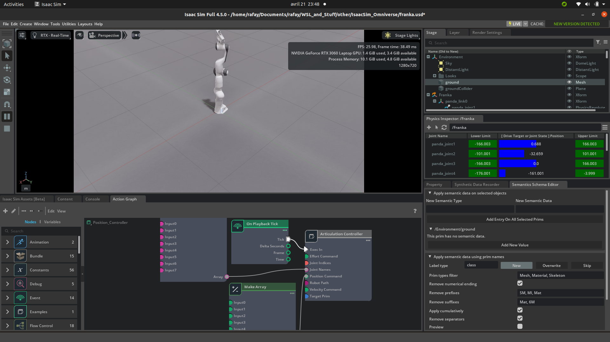

# IsaacSim

This repository contains assets and simulation files for Isaac Sim, NVIDIA's robotics simulation platform. It includes USD files representing robotic models and scenes for use in simulation and development.

## Included Assets

- `four_wheel_robot.usd`: A USD file representing a four-wheel robot model.
- `franka.usd`: A USD file representing the Franka robotic arm model.
- `assets/Franka_init.png`: An image showing the initial setup or configuration of the Franka robot.

## Preview

## Usage

Use these USD files within the Isaac Sim environment to simulate and test robotic behaviors and interactions.

## License

This repository is provided as-is without any warranty. Please refer to the individual asset licenses if applicable.

## Resources
- [workflows](https://docs.isaacsim.omniverse.nvidia.com/4.5.0/introduction/workflows.html)

- [isaac-sim-core-api](https://docs.isaacsim.omniverse.nvidia.com/4.5.0/core_api_tutorials/index.html#isaac-sim-core-api-tutorials-page)

- [isaac-sim-robot-gui](https://docs.isaacsim.omniverse.nvidia.com/4.5.0/gui/tutorial_build_robot_in_gui.html#isaac-sim-robot-gui-tutorials)

- [Creating Intelligent Machines with the Isaac SDK](https://www.youtube.com/watch?v=sI4zHNXdtzk)

- [National Robotics Week -- Latest Physical AI Research, Breakthroughs and Resources](https://blogs.nvidia.com/blog/national-robotics-week-2025/?ncid=so-link-339097-vt48&linkId=100000356313708#nicklas-hansen)

- [Articulation Rigging with ROS 2 Bridge](https://www.youtube.com/live/ithYYtUduMQ)

- [Isaac ROS Office Hours: Isaac Perceptor](https://www.youtube.com/live/ZHivDfuEGmE)

- [Using Isaac Sim with ROS2: A Step-by-Step Guide](https://www.youtube.com/watch?v=L1rpxRm0Q1w)

- [saac Sim 4.5 & Isaac Lab 2.0 | Installation & Overview | NVIDIA Omniverse](https://www.youtube.com/watch?v=L1rpxRm0Q1w)

- [reinforcement-learning](https://www.nvidia.com/en-us/use-cases/reinforcement-learning/)

